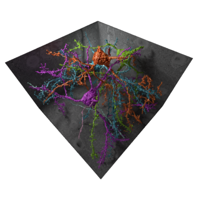
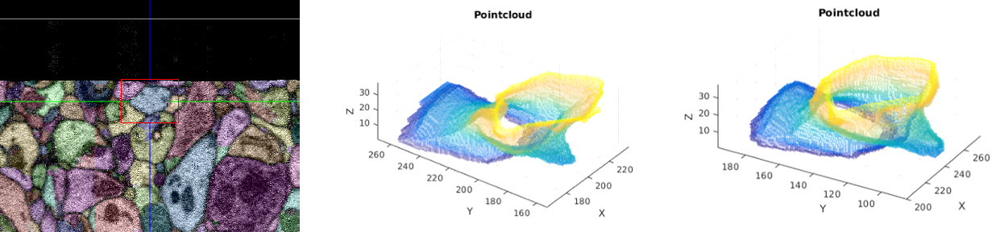

## PointNet autoencoder: *Unsupervised Feature Extraction from Point Clouds*

This work is based on <a  href="https://arxiv.org/abs/1612.00593"  target="_blank">PointNet: *Deep Learning on Point Sets for 3D Classification and Segmentation*</a> by <a  href="http://charlesrqi.com"  target="_blank">Charles R. Qi</a>, <a  href="http://ai.stanford.edu/~haosu/"  target="_blank">Hao Su</a>, <a  href="http://cs.stanford.edu/~kaichun/"  target="_blank">Kaichun Mo</a> and <a  href="http://geometry.stanford.edu/member/guibas/"  target="_blank">Leonidas J. Guibas</a> from Stanford University. In my bachelors thesis <a  href="https://www.ias.informatik.tu-darmstadt.de/uploads/Main/Abschlussarbeiten/robin_hesse_bsc.pdf"  target="_blank">Development and Evaluation of 3D Autoencoders for Feature Extraction</a> I've extended their approach to work as an autoencoder. This allows to learn a feature representation from point clouds. Detailed information about the approach can be found in the thesis. 

_The goal of a 3D shape descriptor is to extract meaningful features. To evaluate if the autoencoder learns useful features it was tested how well it performs in a classification task. For this, the ModelNet40 dataset, which contains 12,311 CAD models with 40 class labels, was used. In the training process, the class labels were not used and the autoencoder just tried to reproduce its inputs. To additionally test how well the autoencoder generalizes only 9,843 of the 12,311 samples were used for training. In the testing process, all samples were transformed into their feature space using the autoencoder and the labels were appended to the respective feature vectors of the training set. Next, a k-nearest- neighbors classification with k=5 was done on the 2,468 unlabeled samples. The accuracy was then calculated by dividing the correctly classified samples by the total number of samples in the test set, i.e. 2,468. This experiment was firstly done with point clouds containing 128 points and the Hungarian version of the cost function and secondly, with point clouds containing 1024 points and the approximated version of the cost function. Jittering and rotation of samples was turned off for performance reasons._

_The first setting with point clouds containing 128 points and using the Hungarian version of the cost function had an accuracy of 82.5%. The second setting with the point clouds containing 1024 points and using the approximated version of the cost function yielded an slightly increased **accuracy of 83.1%**._